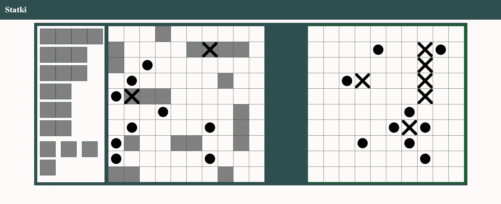

# 🚢 Battleship Game (Statki)

A browser-based Battleship game built with vanilla HTML, CSS and JavaScript. Place your fleet on a 10×10 grid, then take turns shooting against a bot opponent.

---

## Screenshot



---

## Features

- 🗺️ **Ship placement** — drag and rotate ships onto your board before the game starts
- 🔄 **Ship rotation** — right-click to toggle between horizontal and vertical orientation
- 🟢 **Placement preview** — green highlight means valid, red means invalid placement
- 🤖 **Bot opponent** — bot places ships randomly and shoots automatically
- 💥 **Hit & miss indicators** — distinct visuals for hits and misses on both boards
- 🔦 **Active turn highlight** — colored border shows whose turn it is

---

## Fleet

| Ship | Size | Count |
|---|---|---|
| Battleship | 4 | ×1 |
| Cruiser | 3 | ×2 |
| Destroyer | 2 | ×3 |
| Submarine | 1 | ×4 |

Total: **20** ship segments per side.

---

## Getting Started

No build step or dependencies required — it's a single HTML file.

1. Clone or download the repository:

```bash
git clone https://github.com/Avareez/statki.git
cd statki
```

2. Open the project folder in **VS Code**, right-click `index.html` and select **"Open with Live Server"**.

The app will open in your browser at `http://127.0.0.1:5500`.

> The game uses images from the `gfx/` folder (`X.png` for hits, `Dot.png` for misses). Make sure that folder is present alongside `index.html`.

---

## How to Play

### 1 — Place your ships

- Ships are listed in the panel on the left
- Click a ship to select it (highlighted in gray)
- **Right-click** anywhere to rotate the selected ship
- Hover over your board (left grid) to preview placement — **green** = valid, **red** = invalid
- Click the board to place the ship
- Repeat for all ships

### 2 — Start the game

Once all ships are placed, the **PLAY** button appears. Click it to begin.

### 3 — Take turns

| Action | Result |
|---|---|
| Click a cell on the **right** (bot's) board | Fire a shot |
| 💥 Hit | You shoot again |
| 💧 Miss | Bot takes its turn |
| All enemy segments sunk | You win! |

The active board is highlighted with a **green** border (your turn) or **red** border (bot's turn).

---

## Tech Stack

- **HTML / CSS / JavaScript** — no frameworks, no dependencies