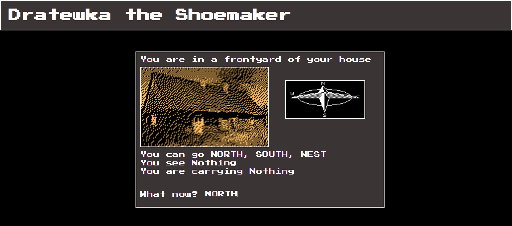

# 🧵 Dratewka the Shoemaker

A text-based adventure game inspired by the Polish folk tale of Skuba the Shoemaker (Dratewka). Explore a medieval map, collect items, interact with NPCs and craft a poisoned sheep to slay the dragon — all through typed commands.

> ⚠️ **Work in progress** — the final chapter of the game (slaying the dragon and completing the story) is not yet implemented.

---

## Screenshot



---

## Features

- 🗺️ **Grid-based world** — explore a hand-crafted map of locations using cardinal directions
- 🎒 **Item system** — pick up, drop and use items to progress through the story
- 🔗 **Dependency chain** — each item leads to the next through location-specific interactions
- 💬 **Gossips & Vocabulary** — in-game hints and command reference accessible at any time
- 🧭 **Compass** — visual indicator showing available directions from each location
- 🎵 **Intro sequence** — animated opening screens with Kraków's hejnał trumpet fanfare

---

## Getting Started

1. Clone or download the repository:

```bash
git clone https://github.com/Avareez/Minor-Projects.git
cd "Minor-Projects/Dratewka"
```

2. Open the project folder in **VS Code**, right-click `Dratewka.html` and select **"Open with Live Server"**.

The app will open in your browser at `http://127.0.0.1:5500`.

> The game loads JSON data and assets from local files, so it **must be served** through Live Server or another local server — opening `Dratewka.html` directly in the browser will not work.

---

## How to Play

### Intro

Press `Space` three times to advance through the opening screens and start the game.

### Commands

All commands are typed into the text input at the bottom of the screen and confirmed with `Enter`. They are case-insensitive.

| Command | Short | Description |
|---|---|---|
| `NORTH` | `N` | Move north |
| `SOUTH` | `S` | Move south |
| `EAST` | `E` | Move east |
| `WEST` | `W` | Move west |
| `TAKE (object)` | `T (object)` | Pick up an item |
| `DROP (object)` | `D (object)` | Drop the item you're carrying |
| `USE (object)` | `U (object)` | Use the item in the right location |
| `GOSSIPS` | `G` | Show in-game hints from locals |
| `VOCABULARY` | `V` | Show the full command reference |

When picking up or using items, refer to them by their **codename written in CAPS** (shown in the game).

### Tips

- You can only carry **one item at a time**
- Most locations have a **3-item storage limit**
- You cannot store items in the **trap location**
- Pay attention to **Gossips** — they hint at what to do and where

---

## Story & Progression

Dratewka needs to craft a **poisoned fake sheep** to lure and kill the dragon terrorising the land. The quest is split into several milestones, each requiring finding the right item and using it in the correct location:

| Milestone | Goal |
|---|---|
| 🐑 Sheep legs | Get a key → open the shed → cut sticks |
| 🛢️ Sheep trunk | Earn money → buy a barrel → assemble the trunk |
| 🧶 Sheep skin | Trade with the butcher → prepare the skin |
| 🪡 Sheep head | Craft a rag → finish the head |
| ☠️ Solid poison | Dig for sulphur → mix the poison |
| 🫙 Liquid poison | Collect tar → mix the poison |
| 🐉 Slay the dragon | *(Not yet implemented)* |

---

## Tech Stack

- **HTML / CSS / JavaScript** — no frameworks, no dependencies
- **ES Modules** — game logic split across multiple JS files
- **JSON** — locations and items loaded from external data files