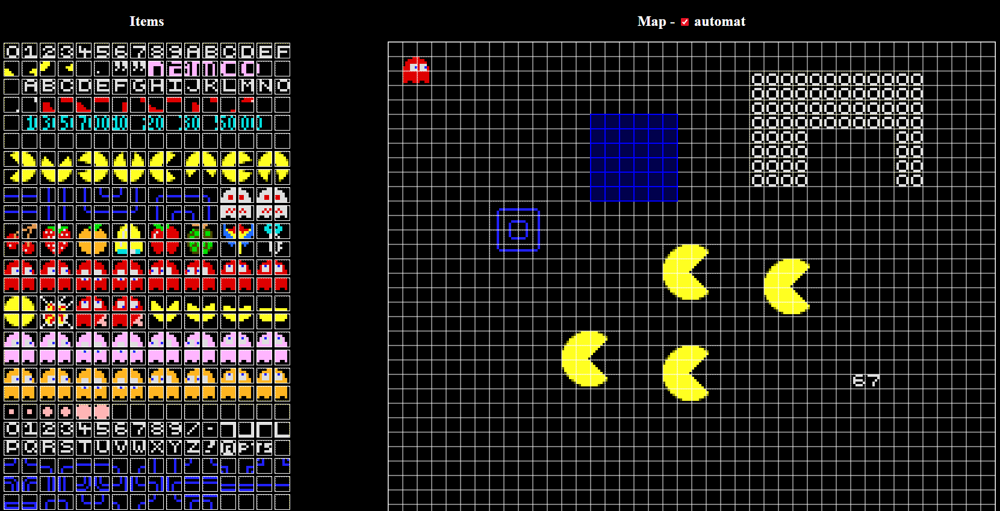

# 🗺️ Map Maker

A tile-based map editor built with TypeScript and HTML Canvas. Paint tiles onto a grid, copy/paste regions, save and load maps as JSON.

---

## Screenshot



---

## Features

- 🖼️ **Sprite picker** — browse and select tiles from a 32×20 sprite sheet
- 🖱️ **Drag selection** — click or drag to select single or multiple map cells
- 📋 **Copy / Cut / Paste** — duplicate regions with live preview
- ↩️ **Undo / Redo** — full history stack
- 🗑️ **Delete** — clear selected cells
- 💾 **Save / Load** — export and import maps as `.json` files
- ⚡ **Auto-advance** — automatically moves selection to the next cell after placing a tile

---

## Getting Started

### Prerequisites

- [Node.js](https://nodejs.org/) (v16 or later)
- npm (comes with Node.js)
- [Live Server](https://marketplace.visualstudio.com/items?itemName=ritwickdey.LiveServer) extension for VS Code

### Installation & Running

```bash
# Clone the repository
git clone https://github.com/Avareez/Minor-Projects.git
cd "Minor-Projects/Map Maker"

# Install dependencies
npm install

# Build the project
npm run build
```

Then open the project folder in **VS Code**, right-click `index.html` and select **"Open with Live Server"**.

The app will open automatically in your browser at `http://127.0.0.1:5500`.

---

## Usage

| Action | How |
|---|---|
| **Select a tile** | Click any tile in the sprite panel on the left |
| **Select map cell(s)** | Click or drag on the canvas |
| **Add to selection** | Hold `Ctrl` and click/drag |
| **Place tile** | Select cells first, then click a sprite |
| **Copy** | `Ctrl + C` |
| **Cut** | `Ctrl + X` |
| **Paste** | `Ctrl + V`, then move the preview and click to confirm |
| **Undo** | `Ctrl + Z` |
| **Redo** | `Ctrl + Y` |
| **Delete** | `Delete` |
| **Save map** | `Ctrl + S` — downloads `map.json` |
| **Load map** | `Ctrl + L` — opens a file picker |

### Auto-advance mode

Enable the **Auto** checkbox to automatically advance the selection to the next cell after each tile placement — useful for quickly filling rows.

---

## Tech Stack

- **TypeScript** — typed source
- **Webpack** — bundler with `webpack-dev-server` for development
- **HTML Canvas** — all rendering
