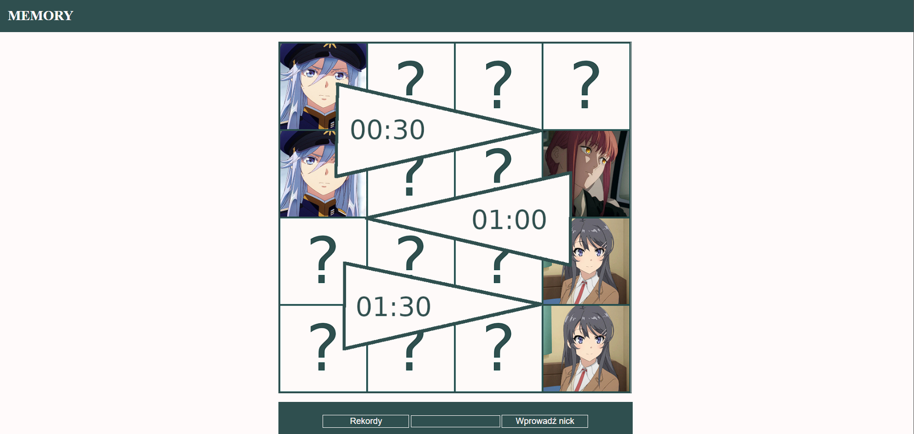

# 🃏 Memory Match

A browser-based Memory card matching game built with vanilla HTML, CSS and JavaScript. Flip cards to find matching pairs before the timer runs out. Three time modes, a leaderboard and nickname support included.

---

## Screenshot



---

## Features

- 🕐 **Three time modes** — 30, 60 or 90 seconds
- 🃏 **16 cards** — 8 pairs shuffled randomly each game
- ⏱️ **Live countdown bar** — visual timer that drains as time passes
- 🏆 **Leaderboard** — top 10 scores per mode saved in browser cookies
- 👤 **Nickname support** — enter your name before playing to appear on the scoreboard
- 🔁 **Restart** — return to the main screen at any time

---

## Getting Started

No build step or dependencies required — it's a single HTML file.

1. Clone or download the repository:

```bash
git clone https://github.com/Avareez/Minor-Projects.git
cd "Minor-Projects/Memory Match Game"
```

2. Open the project folder in **VS Code**, right-click `Memory.html` and select **"Open with Live Server"**.

The app will open in your browser at `http://127.0.0.1:5500`.

> The game requires images in the `img/` folder — `0.jpg` (card back) and `1.jpg` through `8.jpg` (card faces), plus `czolowa.jpg` (title screen). Make sure that folder is present alongside `index.html`.

---

## How to Play

### 1 — Enter your nickname *(optional)*

Type your name in the input field at the bottom and click **"Wprowadź nick"** before starting. This will save your score to the leaderboard.

### 2 — Choose a time mode

Click one of the three areas on the title image to select how long you have:

| Area | Time |
|---|---|
| Top | 30 seconds |
| Middle | 60 seconds |
| Bottom | 90 seconds |

### 3 — Match the cards

- Click any card to flip it
- The timer starts on your **first click**
- Flip a second card — if they match, they stay revealed
- If they don't match, both flip back after a short delay
- Find all **8 pairs** before the timer runs out to win

### 4 — Leaderboard

Click **"Rekordy"** on the main screen to view the top 10 times for each mode. Scores are saved in your browser cookies and persist between sessions.

---

## Tech Stack

- **HTML / CSS / JavaScript** — no frameworks, no dependencies
- **Browser cookies** — used to persist leaderboard scores