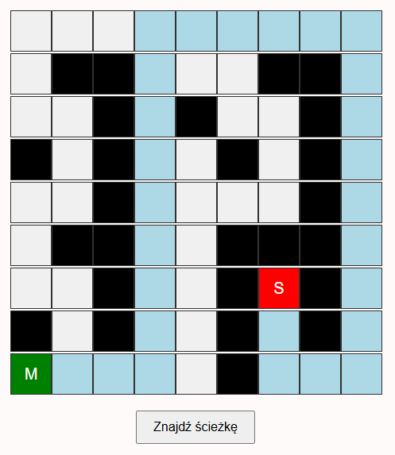

# 🧭 Pathfinder

An interactive shortest path visualizer built with vanilla HTML, CSS and JavaScript. Place a start point, an end point and obstacles on a 9×9 grid, then watch the **BFS (Breadth-First Search)** algorithm find the shortest route.

---

## Screenshot



---

## Features

- 🟢 **Start point** — first cell you click becomes the starting position
- 🔴 **End point** — second click sets the destination
- ⬛ **Obstacles** — any further clicks place walls the path must avoid
- 🔵 **Path highlight** — shortest path is highlighted in light blue after running
- 🔄 **Toggle** — clicking a placed cell removes it, letting you redesign freely
- ⚡ **BFS algorithm** — guarantees the shortest path on an unweighted grid

---

## Getting Started

No build step or dependencies required — it's a single HTML file.

1. Clone or download the repository:

```bash
git clone https://github.com/Avareez/Minor-Projects.git
cd "Minor-Projects/Path Finder"
```

2. Open the project folder in **VS Code**, right-click `pathfinder.html` and select **"Open with Live Server"**.

The app will open automatically in your browser at `http://127.0.0.1:5500`.

> Alternatively, just double-click `pathfinder.html` to open it directly in your browser — no server needed.

---

## How to Use

| Step | Action |
|---|---|
| 1 | Click any cell to set the **start** point (`M`) |
| 2 | Click another cell to set the **end** point (`S`) |
| 3 | Click remaining cells to place **obstacles** |
| 4 | Click **"Znajdź ścieżkę"** to run the algorithm |
| — | Click an existing cell again to **remove** it |

The shortest path will be highlighted in **light blue**, with the destination marked in **red**.

---

## Algorithm

Pathfinder uses **Breadth-First Search (BFS)** on a 9×9 grid with 4-directional movement (up, down, left, right).

- BFS explores cells level by level, so the first time it reaches the destination it is guaranteed to have taken the shortest route.
- Obstacles (`X`) are treated as impassable walls.
- If no path exists, an alert is shown.

---

## Tech Stack

- **HTML / CSS / JavaScript** — no frameworks, no dependencies