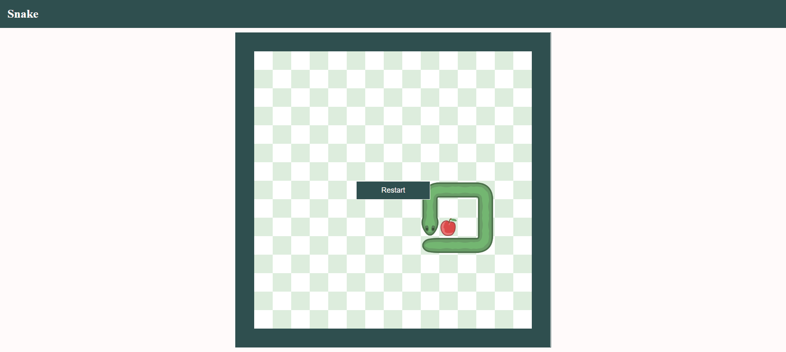

# 🐍 Snake

A classic Snake game built with vanilla HTML, CSS and JavaScript. Guide the snake around a 15×15 grid, eat apples to grow longer, and avoid hitting the walls or yourself. Features smooth sprite-based graphics with proper head, body, curve and tail segments.

---

## Screenshot



---

## Features

- 🎮 **Sprite graphics** — head, body, tail and curve segments all rotate correctly based on movement direction
- 🍎 **Apple spawning** — new apple appears at a random free cell after each pickup
- 💥 **Collision detection** — walls and self-collision end the game
- 🔁 **Restart button** — appears on game over, resets everything back to the starting state
- ⌨️ **Keyboard controls** — arrow keys to move, game starts on first key press

---

## Getting Started

No build step or dependencies required — it's a single HTML file.

> ⚠️ The game loads snake sprite graphics from an external URL, so an **internet connection is required**.

1. Clone or download the repository:

```bash
git clone https://github.com/Avareez/snake.git
cd snake
```

2. Open the project folder in **VS Code**, right-click `index.html` and select **"Open with Live Server"**.

The app will open in your browser at `http://127.0.0.1:5500`.

---

## How to Play

| Key | Action |
|---|---|
| `Arrow keys` | Start the game & steer the snake |
| `↑` | Move up |
| `↓` | Move down |
| `←` | Move left |
| `→` | Move right |

- The game **starts automatically** on your first arrow key press
- Eat the 🍎 **apple** to grow longer
- Hitting a **wall** or your own **body** ends the game
- Click **Restart** to play again

---

## Tech Stack

- **HTML / CSS / JavaScript** — no frameworks, no dependencies
- **External sprite sheet** — snake graphics loaded from [rembound.com](https://rembound.com)