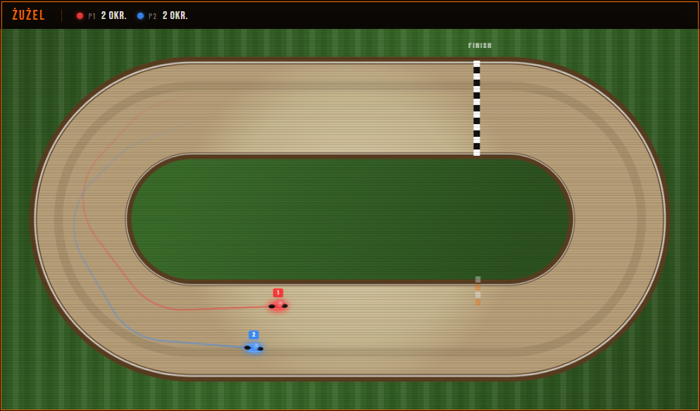

# 🏍️ Speedway (Żużel)

A top-down multiplayer speedway racing game built with vanilla HTML, CSS and JavaScript. Race on an oval dirt track, complete 3 laps and be the first to cross the finish line — or be the last rider left standing.

---

## Screenshot



---

## Features

- 👥 **2–4 players** — local multiplayer on a single keyboard
- 🏁 **3-lap race** — first player to complete 3 laps wins
- 🎨 **Colored riders** — Red, Blue, Green and Yellow with glowing trail effects
- 💥 **Crash detection** — ride off the track and you're out
- 🏆 **Winner screen** — announces the winner (or a draw if everyone crashes)
- ⚙️ **Custom key bindings** — set your own left/right steering keys before the race

---

## Getting Started

No build step or dependencies required — it's a single HTML file.

> ⚠️ The game loads fonts from Google Fonts, so an **internet connection is required** for the full visual experience.

1. Clone or download the repository:

```bash
git clone https://github.com/Avareez/Minor-Projects.git
cd "Minor-Projects/Speedway Game"
```

2. Open the project folder in **VS Code**, right-click `Speedway.html` and select **"Open with Live Server"**.

The app will open in your browser at `http://127.0.0.1:5500`.

---

## How to Play

### Setup

1. Select the number of players (2–4) from the dropdown
2. Optionally change the steering keys for each player in the input fields
3. Click **START**

### Controls

Each player steers with two keys — turn left and turn right. Default bindings:

| Player | Color | Turn Left | Turn Right |
|---|---|---|---|
| 1 | 🔴 Red | `A` | `D` |
| 2 | 🔵 Blue | `J` | `L` |
| 3 | 🟢 Green | `Q` | `E` |
| 4 | 🟡 Yellow | `N` | `M` |

### Rules

- Complete **3 laps** to win — laps are counted each time you pass the finish line
- Riding **off the track** eliminates you immediately
- If only one rider remains on track, they win regardless of laps
- If everyone crashes, it's a **draw**
- Press **F5** to restart after a race ends

---

## Tech Stack

- **HTML Canvas** — all rendering
- **HTML / CSS / JavaScript** — no frameworks, no dependencies
- **Google Fonts** — Bebas Neue & Barlow Condensed (requires internet)